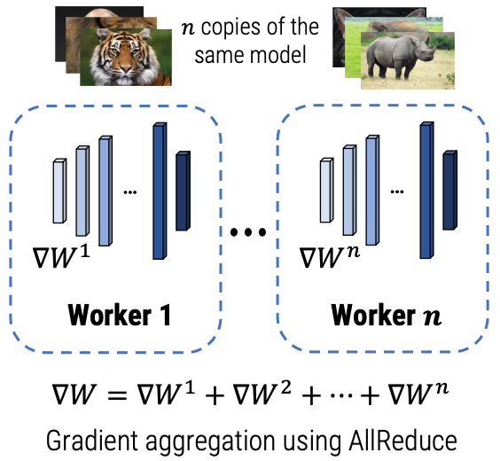
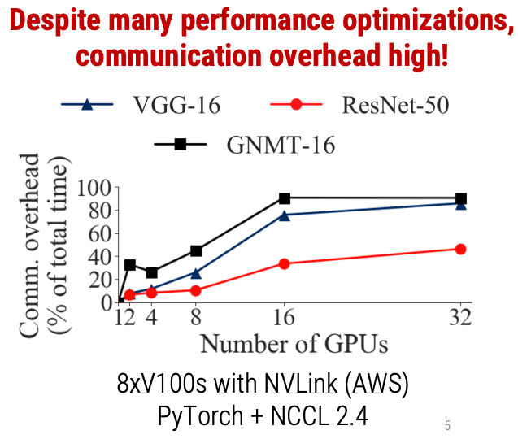
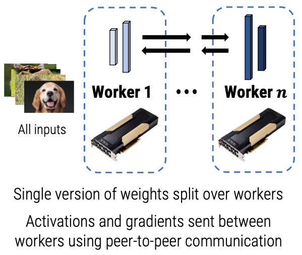
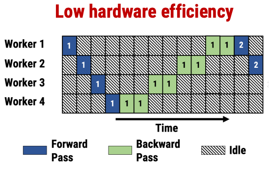
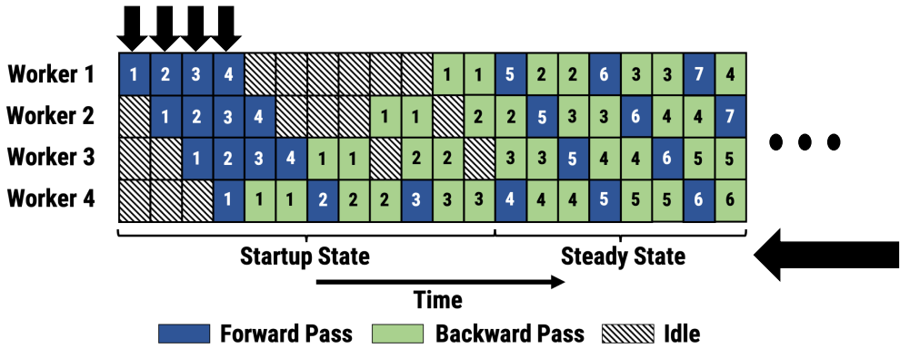
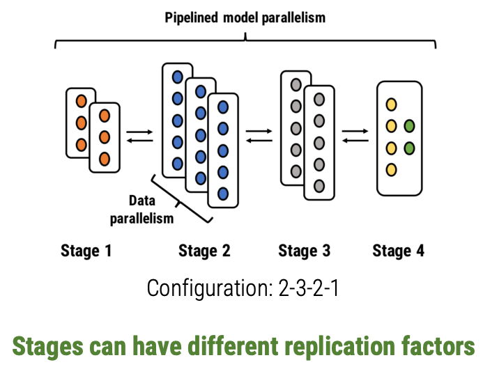

# PipeDream: Generalized Pipeline Parallelism for DNN Training

Paper: [Deepak Narayanan, Aaron Harlap, Amar Phanishayee, Vivek Seshadri, Nikhil R. Devanur, Gregory R. Ganger, Phillip B. Gibbons, and Matei Zaharia. 2019. PipeDream: generalized pipeline parallelism for DNN training. In <i>Proceedings of the 27th ACM Symposium on Operating Systems Principles</i> (<i>SOSP '19</i>). Association for Computing Machinery, New York, NY, USA, 1–15. DOI:https://doi.org/10.1145/3341301.3359646](https://dl.acm.org/doi/10.1145/3341301.3359646)

<!---
- [ ] Introduction
- [ ] Background and Related Work
  - [ ] Intra-batch Parallelism
  - [ ] Inter-batch Parallelism
  - [ ] DNN Model and Hardware Diversity
- [ ] Pipeline Parallelism
  - [ ] Challenge 1: Work Partitioning
  - [ ] Challenge 2: Work Scheduling
  - [ ] Challenge 3: Effective Learning
- [ ] Implementation
- [ ] Evaluation
  - [ ] Experimental Setup
  - [ ] Comparison to Data Parallelism
  - [ ] Comparison to Other Intra-batch Parallelism Schemes
  - [ ] Comparison to Inter-batch Parallelism
  - [ ] Microbenchmarks
- [ ] Conclusion
-->

## Summary

PipeDream is a new way to parallelize DNN (Deep Neural Network) training over multiple accelerators.

### Deep Neural Networks (DNNs)
DNN have empowered state of the art results across a range of applications such as image classification, machine translation, speech to text, and game playing (e.g. AlphaGo). A DNN needs to be first trained before they can be deployed in an application. Training a DNN model involved finding weight parameters W that fit a training dataset consisting of examples and associated labels. During the training process an input sample is passed to the model, generating intermediate outputs called activations, and a prediction that might be incorrect. Errors between the predictions and the true labels, are back-propagated back through the model, generating gradients and weight updates. These weight updates can then be used to update the latest weight parameters. To be able to train a model, a large number of iterations need to be performed, which is time and compute intensive.

In order to obtain trained models in a more reasonable timeframe, people have resorted to parallelizing over multiple accelerators (GPUs). Common ways to do this:

1. Data Parallelism

  

  Every worker has a copy of the model. Inputs are sharded, weight updates are generated independently on each worker, and these are aggregated periodically using communication collectives like AllReduce.

  Problems:
    - this communication overhead (as % of total time) is high. They show that on 8-GPU (V100) GPU servers on AWS (with NVLink) running PyTorch and NCCL 2.4, for 3 different models (VGG-16, ResNet-50, and GNMT-16), the communication overhead is often as high as 80% (for 32 GPUs). The ResNet-50 model scales better (40% communication overhead) because it has compact weight representations which allowed it to scale more gracefully.
    
    - does not work if the model doesn't fit on a single worker. Model parallelism solves this.

2. Model Parallelism

  

  A single version of the weights are split over the workers. Instead of doing an expensive AllReduce communication call, we can just do peer-to-peer communication across the different workers of these intermediate activations and gradients.

  Problems:
    - low hardware efficiency. Note that backward passes are expensive than forward passes. The numbers in the boxes show the ID of the input that's flowing through the system at that time point. At most 1 worker is active at any point in time.
    

### Pipeline Parallelism
This is a combination of data parallelism and model parallelism with pipelining.
Multiple inputs are injected in the pipeline at any point in time. This ensures that in steady state, none of the workers are idle. The total amount of time in steady state far exceeds the total amount of time spent in the startup state. This is 5.3x faster compared to data parallelism without sacrificing the final accuracy of the model.

Even though pipelining is a common optimization used in systems such as in CPU processors, pipelining in DNN training has some challenges:
- How to assign operators in DNN models into pipeline stages? Each operator consumes a different computation time, and activations and gradients are communicated across stages.
- How to schedule the forward and backward passes of different inputs?
- Backward pass operators are stateful, depending on current weight parameters and activations computed in the forward pass. How should weight and activation versions be managed?

### Challenge 1: Assigning operators to pipeline stages
Where to chop your model across the different workers? Each chop is a stage.

We want to:

- the time required for each stage is as close to each other as possible. This ensures compute resources are occupied, leading to better hardware efficiency.
- the activations and gradients communicated between different stages and we want to reduce the time required for this communication. The less time we spent communicating, the better the hardware efficiency.

**Stage Replication**

Merely splitting operators over the workers doesn't always give us a good pipeline setup. Suppose a model has 2 operators with first one having a compute time of 2 units (throughput = 1/2), and second one having a compute time of 1 unit (throughput = 1). So the 2nd worker will spend time waiting for the first worker to complete its processing in steady state. We can solve this by replicating the first stage (throughput = 1/2 * 2 = 1).

- This gives us good load balancing across stages.
- Also for some operators, the amount needed to communicate doing data parallel updates is much smaller than size of the intermediate activations & gradients.

Stage Replication helps load balance computation & reduce communication between workers.

PipeDream partitions operators among different workers and also decides on the appropriate replication factor. This is done using a profiler and an optimizer. The optimizer is able to generalize among many different axes: hardware topologies, model structures, memory capacities of workers. The paper describes the algorithm.

### Challenge 2: Scheduling forward and backward passes of different inputs
PipeDream uses a 1F1B scheduling where workers are alternating between forward and backward passes (in steady state). This ensures:
- workers are always utilized (in steady state)
- gradients are used to update the model immediately

This mechanism is slightly modified to support stage replication.

### Challenge 3: Managing weights and activation versions
Naive pipelining leads to mismatch in weight versions. Consider an input $x_n$ moving through the pipeline, uses some weight version $W_n$ on a particular worker and generates an output $y_n$ in the forward pass. As other inflight inputs complete their backward passes, the weight version gets updated. When the backward happens for the same input $x_n$, the weight version might have advanced to $W_{n+p}$. This leads to incorrect gradients.

To solve this PipeDream uses Weight Stashing.

**Weight Stashing**

It stores multiple weight and activation versions to ensure that the same weight version is used in both forward and backward pass for a particular input. The worst case memory footprint is similar to data parallelism, because even though we are storing more versions of weights and activations, each of these are smaller because the operators in the model are split over many workers.

### Evaluation

#### Setup
- PipeDream is integrated with PyTorch in ~3000 lines of Python
- Used PyTorch's communication library for inter-worker communication, used the NCCL backend for data parallelism baselines (optimized for AllReduce), and Gloo backend for PipeDream's communication
- Ran experiments on 3 different server types
  - Cluster A: 4xV100 GPUs, PCIe intra-server, and 10 Gbps inter-server (Azure)
  - Cluster B: 8xV100 GPUs, NVLink intra-server, and 25 Gbps inter-server (Azure)
  - Cluster C: 1xTitan X, and 40 Gbps inter-server (private)

#### PipeDream compared to Data Parallelism
Training a VGG-16 image classification model. PipeDream is able to train models up to 5.3x faster than Data Parallelism. They also experimented on 4 different tasks: image classification, translation, language modeling, video captioning, and with same number of GPUs, PipeDream is able to go up to 5.3x faster than Data Parallelism.

The optimizer recommends a large number of different configurations like 15-1, Straight (no stage replication), and even a fully data parallel setup for ResNet-50 which has extremely compact weights where Data Parallelism scales fairly gracefully.

The reason for the speedup is because PipeDream reduces the communication overhead across different workers. For many models, intermediate activations and gradients are order of magnitude smaller than communication with Data Parallelism.

The paper also shows speedups of PipeDream compared to other intra-batch parallelism schemes like model parallelism & hybrid parallelism.

### Conclusion
Model and Data Parallelism suffer from high communication overhead, and low resource utilization for certain models and deployments. PipeDream shows pipelining can be used to accelerate DNN training. Pipelining, when combined with data and model parallelism achieves end-to-end speedups of up to 5.3x.

## Strengths & Weaknesses
### Strengths
- The authors bring the advantages of pipelining to DNN training, solving the problems of hardware efficiency, statistical efficiency while achieving up to 5.3x speedup compared to existing approaches of data parallelism, model parallelism and other hybrid approaches. The problem of hardware efficiency for accelerators is important from the perspective of datacenter efficiency and management.
- PipeDream automatically determines how to partition the DNN operators based on a short profiling run on a single GPU & employ stage replication (data parallelism) to avoid pipeline stalls due to differences in throughput between stages. These ideas are not new, but applied in other areas of computer science, for e.g. in processor architectures.

### Weaknesses
- There is a memory footprint of PipeDream because a version of <weights, activations> is needed for each in-flight mini-batch. Even though the memory footprint can be reduced by efficient encoding, intermediate data compression, gradient aggregation. They do mention these techniques but the work hasn't explored further.
- The evaluation is done using models which are sequential in topology, and does not have a lot of branching. It would be interesting to see how the system performs with more variety of models.

## Follow-on
- An immediate follow-on idea is to reduce the memory footprint of PipeDream by the mentioned techniques of efficient encoding, gradient compression etc. Also, it might be interesting to automate the decision of employing which technique to use based on the memory constraints. An extreme case is trading computation time for activation-stash memory by discarding them in the forward pass and recomputing them as needed during the backward pass. Choosing a better representation might let PipeDream also include vertical sync, which needs to maintain state at every pipeline stage, and eliminates potential inconsistency across stages.
- Another interesting future extension is exploring the behavior of the system when some worker (GPU) nodes fail, and new ones are attached. Ideally, we would like the training to scale with the number of nodes, while maintaining hardware efficiency, statistical efficiency, and model quality. On node failure, we expect graceful degradation of training performance, but without halting the long training process.

---
